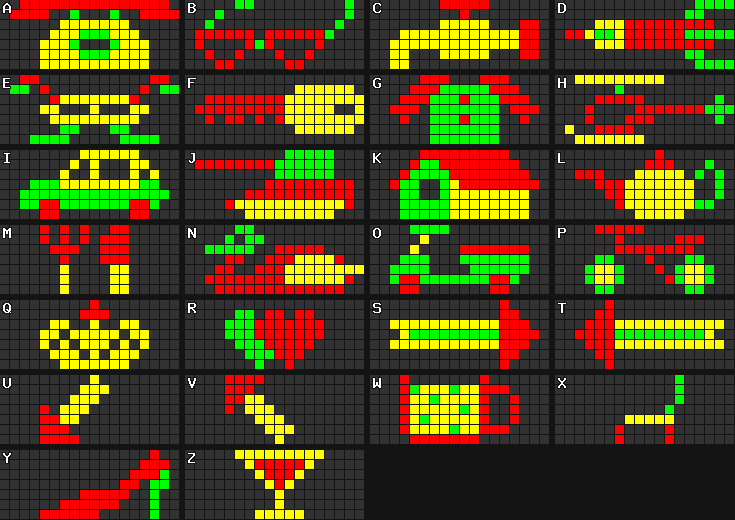

# ProLite PL-M2014R Protocol

This is a PHP implementation of the [Prolite PL-M2014R](https://wls.wwco.com/ledsigns/prolite/) protocol. The PL-M2014R is an electronic LED sign. With this library, you can create pages, timers and graphics and generate the protocol lines to transfer them to the sign.

This implementation is not complete.

* Support for trivia is absent, as our firmware version does not support trivia.
* The string escaping is a bit too agressive.
* Special characters (or _European characters_ as the documentation calls them) are not automatically escaped, but instead either translated into their non-special ASCII equivalents or simply muted.

---

- [Usage](#usage)
  * [Page bank](#page-bank)
  * [Graphics bank](#graphics-bank)
  * [Timer bank](#timer-bank)
  * [Formatting text](#formatting-text)
  * [Other useful functions](#other-useful-functions)
- [Contributing](#contributing)
- [License](#license)

# Usage
First install the library:
```sh
composer require knevelina/prolite
```

Start by creating a `Display` instance with the correct display ID:

```php
<?php
use Knevelina\Prolite\Display;

$display = new Display(1);
```

Now use the graphics bank, page bank and timer bank to configure the display:

```php
$display->getGraphicsBank();
$display->getPageBank();
$display->getTimerBank();
```

Finally, use `getConfiguration(bool $reset = true): string` to get the text you should send to the display to apply your configuration. Setting `$reset` argument (`true` by default) resets the display before applying the configuration. This is highly recommended.

```php
$config = $display->getConfiguration();
```

The configuration should now be sent line by line to the display. The display will respond with its identification followed by a new line after each succesful request. It's important that you wait for this acknowledgement, otherwise the display will crash.

PHP is not really able to write to a serial port, so you should consider using something else like Node.JS or Python to accomplish that. An example script, which uses [pySerial](https://github.com/pyserial/pyserial/), is included in [`examples/writetty.py`](examples/writetty.py).

## Page bank
The most important building block of the Prolite sign is the page. The sign can store up to 26 pages. The sign identifies them by letter in the alphabet; the library identifies them by their numerical index, starting at 0. So page A has index 0, page B has index 1, ..., and page Z has index 25.

Every page stores roughly 1024 characters, but this library enforces 1000 as a hard limit to stay on the safe side. You should thus split large pages yourself before setting them with the library, or else an exception will be thrown.

Interacting with the page bank is as simple as you'd expect:

```php
$pageBank = $display->getPageBank();

$pageBank->hasPage(0); // false
$pageBank->setPage(0, 'Hello, world!');
$pageBank->hasPage(0); // false
$pageBank->getPage(0); // Hello, world!
```

## Graphics bank
The `GraphicsBank` of the display contains user-defined and default graphics. The display supports defining and using 26 different graphics of 18 pixels wide and 7 pixels high, consisting of red, yellow, green and black pixels. Graphics are defined as strings of 126 characters.

26 default graphics are included:



You can use the built-in graphics by including `<B_>` in your message, replacing `_` with the letter of the graphic you'd like to use.

While some graphics are nice to have, others (like the monster, the chair and the glasses) are quite boring. Luckily you can define your own graphics. This is done using a call to `setGraphic(int $index, Graphic $graphic)`. The first argument is an instance of the `Graphic` class, which takes the graphic specification as its first and only argument:

```php
use Knevelina\Prolite\Models\Graphic;

$graphicsBank = $display->getGraphicsBank();

$graphicsBank->setGraphic(0, new Graphic('RGYB...'));

$display->getPageBank()->setPage(0, 'Hello, world! <BA>');

$graphicsBank->getGraphic(0);
$graphicsBank->getGraphic(1); // Returns the default graphic at index 1.
```

## Timer bank
The timer bank allows you to let the display show different pages after each other. The display supports up to 10 timers. Every timer has a day of week, hour and minute when it should activate, and the sequence of pages that is shown when the timer activates. The timer is the solution for displaying messages longer than 1000 characters.

The time settings work a bit like those of cron jobs, in the sense that you can omit time settings (by setting them to -1) to indicate that a timer should activate every time. For example, to have a timer activate every day of week at 2:30 AM, use -1, 2 and 30 as the day of week, hour and minute respectively.

The sequence of pages can be at most 32 pages; more pages are ignored by the sign and rejected by the library. You can use one page multiple times in one sequence.

```php
$timerBank = $display->getTimerBank();

$timerBank->hasTimer(0); // false
$timerBank->setTimer(0, new Timer(-1, 2, 30, [0, 1, 2, 3]));
$timerBank->hasTimer(0); // true
$timerBank->getTimer(0);
```

Good to know: a timer which activates always (-1 for every field) only activates after it has finished displaying its entire sequence. In other words, to simply set a bunch of pages on loop, set a timer to fire every minute with those pages as a sequence.

Of course specific timers are only useful when the clock of the display has been set correctly:

```php
// 2021-03-01, 12:30:27
$display->setDateTime(2021, 3, 1, 12, 30, 27);
```

## Formatting text
The `DisplayText` class has a lot of useful `DISPLAY_`, `COLOR_`, and `FORMAT_` constants.

First, the `DISPLAY_` constants change the way the text on the screen behaves. You use them by inserting them in your page contents, for example like so:

```php
use Knevelina\Prolite\DisplayText;

$display->getPageBank()->setPage(0, sprintf('%sPoof!', DisplayText::DISPLAY_APPEAR));
```

The behavior of the various display constants is described in their phpDoc.

Next, you can set the color of text using the `COLOR_` constants. You use them the same way as the display constants. The color remains set until another color is set, or when the end of the page is reached.

Finally, you can set the formatting of the text using the `FORMAT_` constants. The `format(bool $flashing, bool $italic, bool $bold): string` function can help in finding the right constant, for example when letting users choose their formatting in a GUI.

```php
use Knevelina\Prolite\DisplayText;

$display->getPageBank()->setPage(0, sprintf('%sThat is very bold of you.', DisplayText::format(false, false, true)));
```

## Other useful functions
Lots of special characters and other things you'd expect to work on the sign don't. The sign only supports a limited subset of ASCII. To help you out with crafting the right messages for the sign, the `DisplayText` class has two very useful functions.

The `escape(string $string): string` function escapes a string to strip it from special commands. You should definitely pass user input through this function when it will be displayed on the sign.

The `normalize(string $string): string` function modifies a string to reduce it to the character set allowed by the sign. It does this while trying to transform special characters to their ASCII equivalent. For example, _mon frère a acheté de la crème fraîche_ would be changed to `mon frere a achete de la creme fraiche`.

# Contributing
Some guidelines:

* This library follows the PSR-1 and PSR-12 coding style.
* New code should have tests confirming the code works.
* The tests are "dry" in the sense that I don't run the code against an actual sign. However, the test cases are based on real experience with the sign. When adding new tests, please include proof that you actually tested the configuration on a sign.

# License
MIT. See [LICENSE](LICENSE).